# User Manual - LABsistem

## 1. Uvod i namjena sistema

LABsistem je web aplikacija za upravljanje laboratorijskim terminima, opremom i korisnicima. Sistem je namijenjen fakultetskim laboratorijama gdje više korisničkih uloga mora raditi koordinisano i sa jasnim pravilima pristupa.

### Kome je sistem namijenjen

- studentima koji se prijavljuju na termine
- profesorima/asistentima koji rezervišu termine i odobravaju zahtjeve
- laboratorijskim tehničarima koji upravljaju opremom i kvarovima
- administratorima koji upravljaju korisnicima i objektima

## 2. Korisničke uloge

U sistemu postoje sljedeće uloge:

- Student
- Profesor / Asistent
- Laboratorijski tehničar
- Administrator

Svaka uloga vidi prilagođen meni i ima pristup samo svojim funkcijama.

## 3. Prijava i pristup

### 3.1 Prijava

1. Otvorite stranicu prijave.
2. Unesite korisničko ime ili email adresu.
3. Unesite lozinku.
4. Kliknite "Prijavi se".

Očekivani rezultat:

- Ako su podaci ispravni, ulazite u sistem i otvara se Dashboard.
- Ako je sesija istekla, prikazuje se poruka i potrebno je ponovo se prijaviti.
- Ako je lozinka privremena, sistem vas preusmjerava na "Prva promjena lozinke".

### 3.2 Prva promjena lozinke

Korisnici koji dobiju privremenu lozinku (npr. nakon kreiranja naloga) moraju je odmah promijeniti.

1. Unesite novu lozinku.
2. Potvrdite novu lozinku.
3. Kliknite "Sačuvaj novu lozinku".

Očekivani rezultat:

- Lozinka se mijenja i prelazite na Dashboard.

### 3.3 Zaboravljena lozinka

1. Na prijavi izaberite "Zaboravljena lozinka?".
2. Unesite email adresu.
3. Kliknite "Pošalji link za resetovanje".

Očekivani rezultat:

- Sistem šalje email sa linkom za reset lozinke (ako nalog postoji).

### 3.4 Reset lozinke

1. Otvorite link iz emaila.
2. Unesite novu lozinku i potvrdu.
3. Kliknite "Resetuj lozinku".

Očekivani rezultat:

- Lozinka je promijenjena i možete se prijaviti.

### 3.5 Verifikacija email adrese

Korisnik dobija email za verifikaciju. Klikom na link email postaje verifikovan.

Očekivani rezultat:

- Status emaila se mijenja u "Verifikovan" na profilu.

## 4. Testni korisnici / demo kredencijali

Testne korisnike i njihove lozinke obezbjeđuje administrator sistema.

Demo nalozi i lozinke:

- student: student / student123
- profesor: profesor / profesor123
- tehničar: tehnicar / tehnicar123
- admin: admin / admin1234

## 5. Glavna navigacija i zajednički elementi

### 5.1 Bočni meni

Prikazuje samo stranice dostupne vašoj ulozi.

### 5.2 Gornja traka

- prekidač teme (svijetli/tamni režim)
- obavijesti (ikona zvona)
- korisnički meni (profil, o aplikaciji, odjava)

### 5.3 Obavijesti

- prikaz broja nepročitanih obavijesti
- otvaranje liste obavijesti
- označi sve kao pročitano
- obriši pojedinačnu obavijest ili sve

Očekivani rezultat:

- broj nepročitanih obavijesti se ažurira
- status obavijesti se mijenja u pročitano

### 5.4 Odjava

1. U korisničkom meniju izaberite "Odjavi se".

Očekivani rezultat:

- sesija se zatvara i korisnik se vraća na prijavu.

### 5.5 Pristup odbijen

Ako otvorite stranicu kojoj vaša uloga nema pristup, prikazuje se stranica "Nemate pristup ovoj stranici".

Očekivani rezultat:

- prikazuje se poruka i dugme za povratak na Dashboard.

## 6. Opis glavnih ekrana

### 6.1 Dashboard (sve uloge)

Dashboard prikazuje brzu statistiku i pregled važnih podataka.

Student vidi:

- aktivne rezervacije
- dostupne termine
- zahtjeve na čekanju

Profesor vidi:

- zahtjeve studenata
- aktivne rezervacije
- javne termine

Tehničar vidi:

- termine danas
- broj opreme
- prijavljene kvarove
- listu kvarova sa opcijama: Obrada, Riješi, Obriši

Administrator vidi:

- broj korisnika
- broj aktivnih objekata
- broj kabineta

Očekivani rezultat:

- statistike i tabele se prikazuju prema ulozi.

Student:
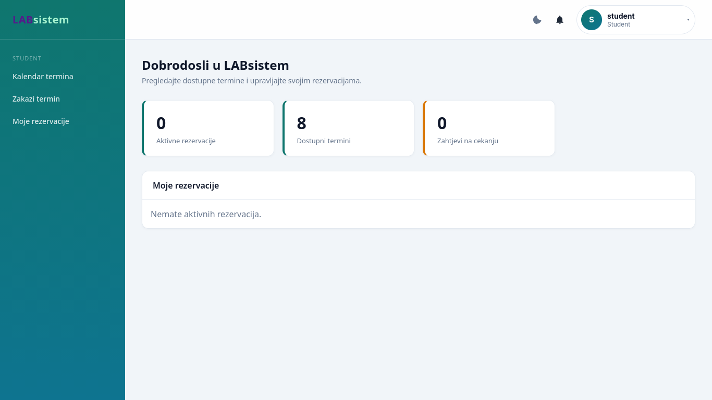

Profesor:
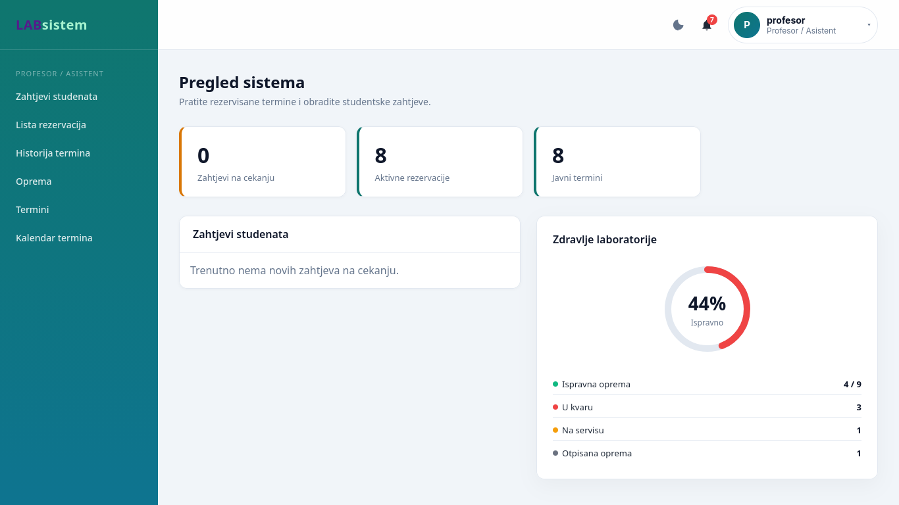

Tehničar:
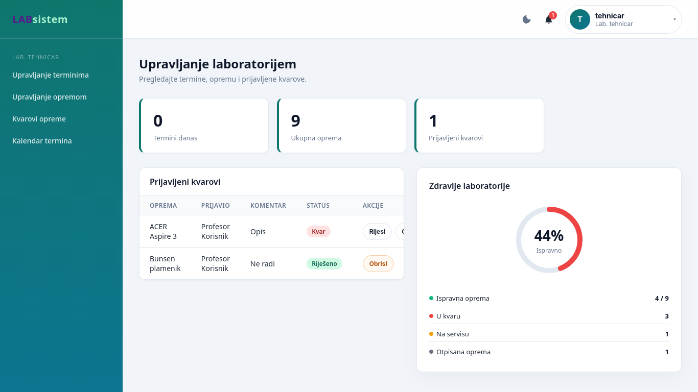

Administrator:
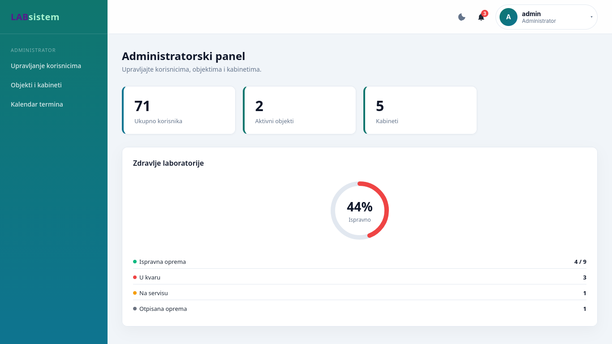

### 6.2 Kalendar termina (sve uloge)

Kalendar prikazuje termine po datumima i statusima (slobodan, zauzet, blokiran).

Glavne funkcije:

- filtriranje po kabinetu
- pregled detalja termina u desnom panelu
- legenda sa bojama i brojačima

Očekivani rezultat:

- odabrani termin prikazuje detalje (kabinet, datum, vrijeme, kreator, status).

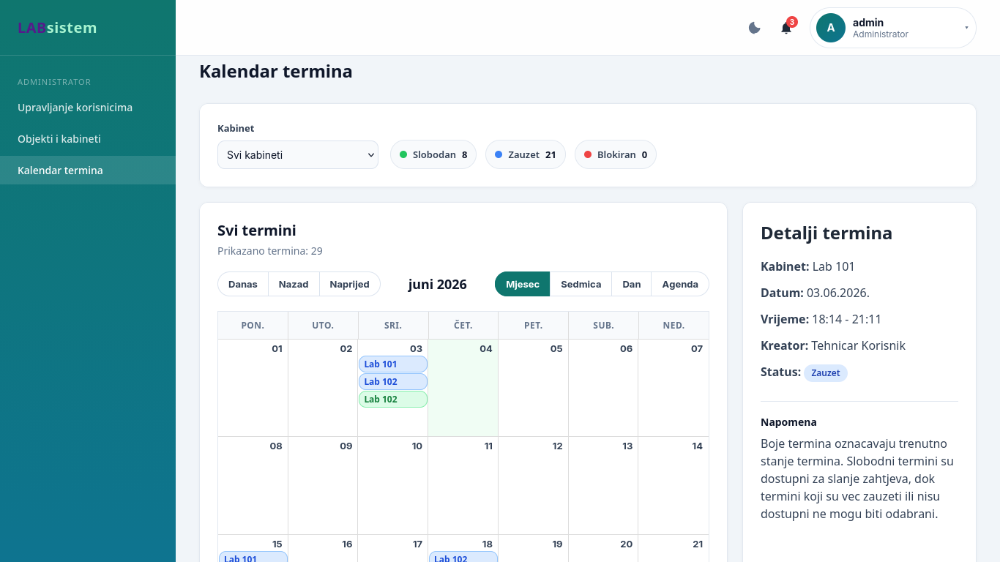

### 6.3 Zakaži termin (Student)

Student može poslati zahtjev za slobodan termin koji je profesor učinio vidljivim.

Koraci:

1. Otvorite "Zakaži termin".
2. Pregledajte listu dostupnih termina.
3. Kliknite "Pošalji zahtjev".
4. Opcionalno otvorite detalje opreme klikom na naziv kabineta.

Očekivani rezultat:

- status zahtjeva postaje "Na čekanju".
- termin se pojavljuje u "Moji zahtjevi" dok profesor ne odluči.

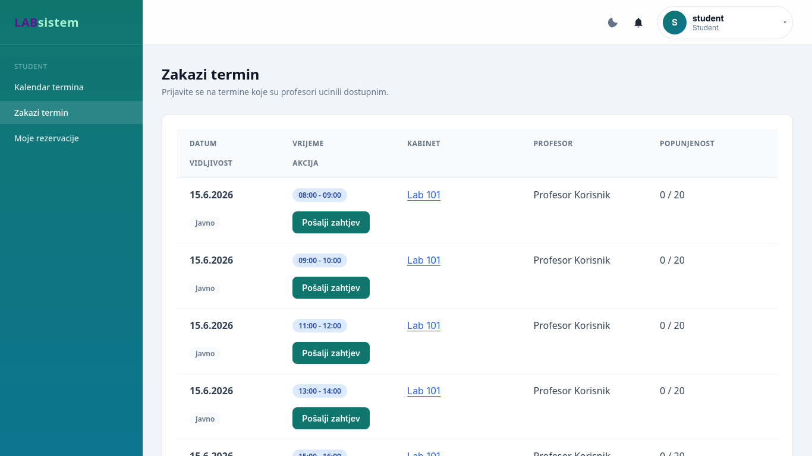

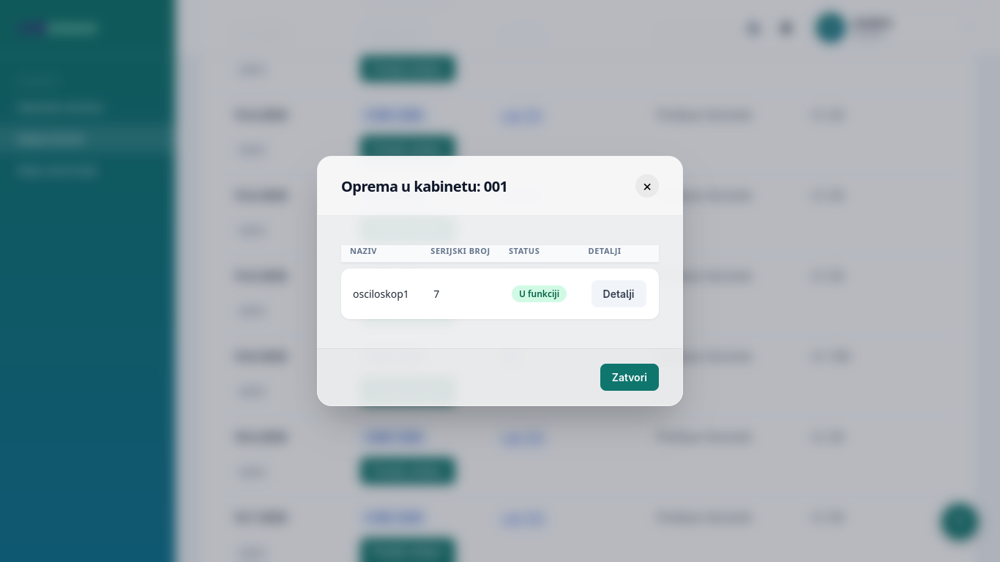

### 6.4 Moje rezervacije / Lista rezervacija (Student, Profesor)

Student vidi aktivne rezervacije i poslane zahtjeve. Profesor vidi svoje rezervisane termine.

Funkcije:

- filter po datumu i kabinetu
- izvoz u CSV/PDF
- otkazivanje rezervacije ili zahtjeva

Očekivani rezultat:

- nakon otkazivanja termin se uklanja sa liste aktivnih.

Student:
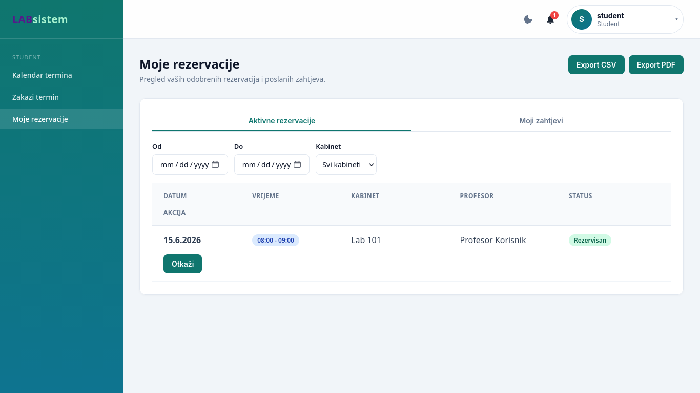

Profesor:
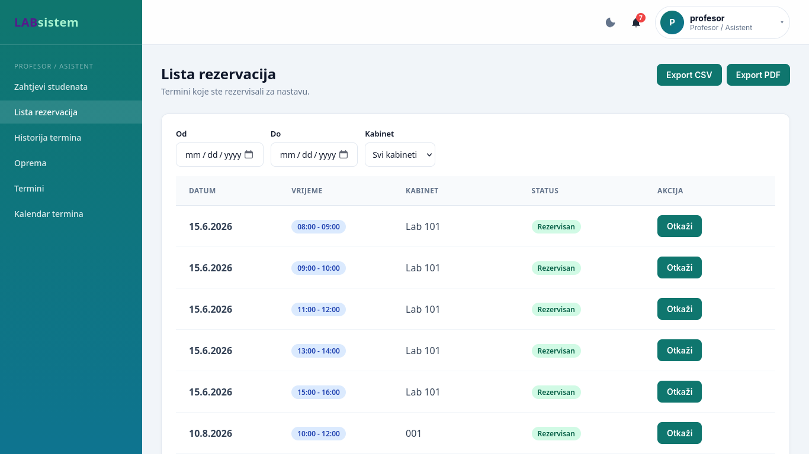

### 6.5 Zahtjevi studenata (Profesor)

Profesor odobrava ili odbija zahtjeve za termine.

Koraci:

1. Otvorite "Zahtjevi".
2. Kliknite "Odobri" ili "Odbij".
3. Unesite komentar (opcionalno).
4. Potvrdite.

Očekivani rezultat:

- status zahtjeva se ažurira, student dobija obavijest.

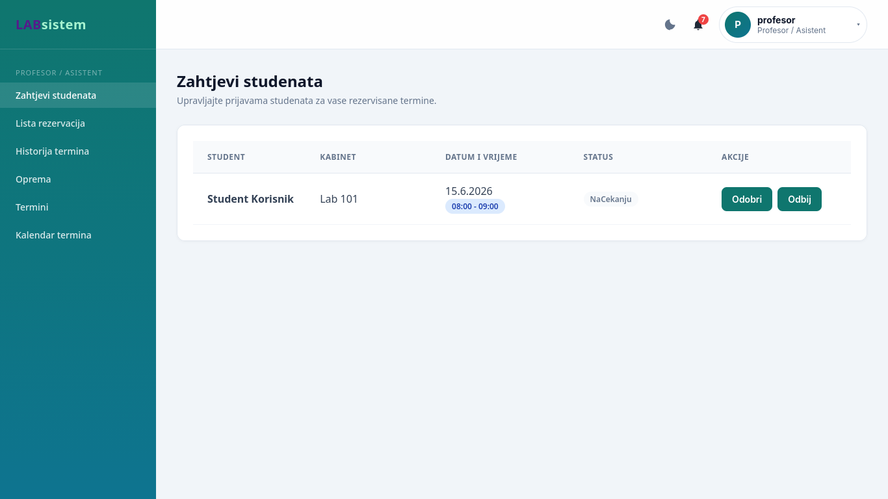

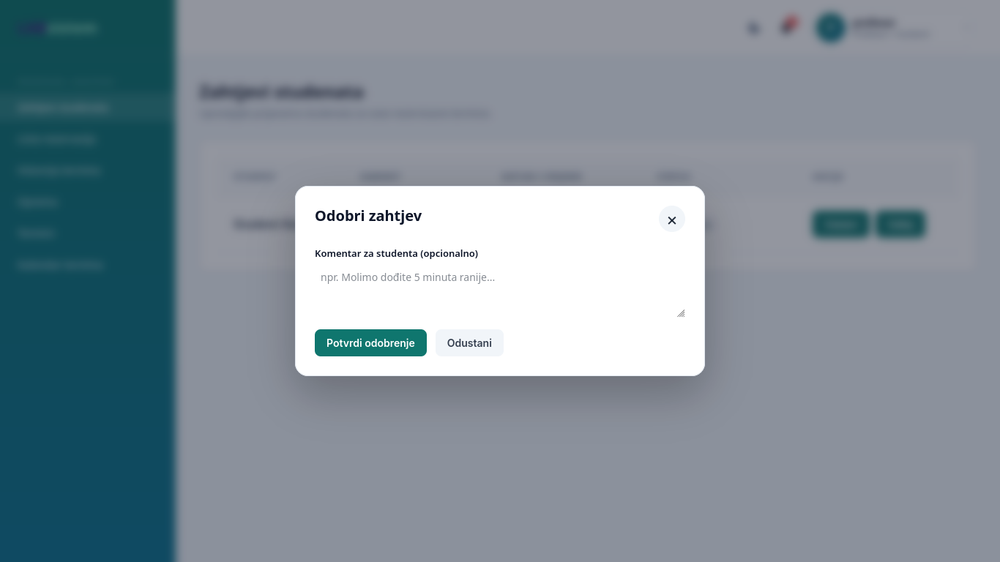

### 6.6 Upravljanje terminima (Tehničar, Profesor)

Tehničar (i admin) mogu dodavati i uređivati termine. Profesor može rezervisati slobodan termin.

Tehničar - dodavanje termina:

1. Kliknite "Dodaj termin".
2. Unesite datum, vrijeme i kabinet.
3. Sačuvajte.

Očekivani rezultat:

- novi termin se pojavljuje u listi.

Profesor - rezervacija termina:

1. U listi termina kliknite "Rezerviši".
2. Unesite limit osoba (ne veće od kapaciteta kabineta).
3. Označite da li je termin vidljiv studentima.
4. Potvrdite rezervaciju.

Očekivani rezultat:

- termin postaje rezervisan i vidljiv (ako je označeno).

Tehničar:
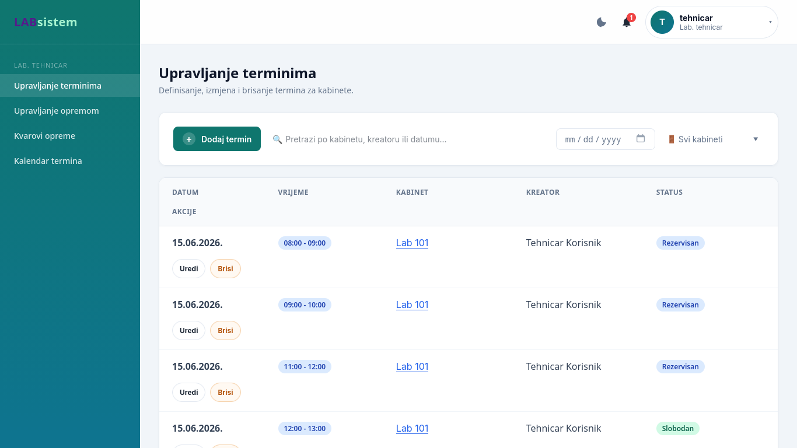

Profesor:
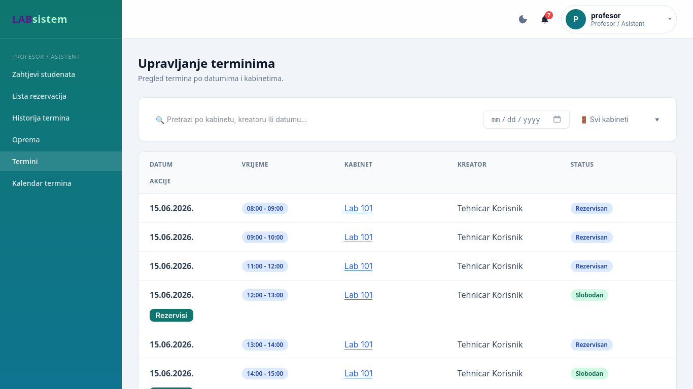

### 6.7 Upravljanje opremom (Tehničar, Admin; pregled Profesor)

Lista opreme sa filtrima po statusu, kabinetu, zgradi i kategoriji.

Tehničar/Admin mogu:

- dodati opremu
- urediti opremu
- arhivirati i vratiti opremu iz arhive
- dodati dokumentaciju (PDF ili URL)

Profesor može:

- pregledati opremu i dokumentaciju

Očekivani rezultat:

- promjene se vide u listi opreme, dokumentacija se može preuzeti.

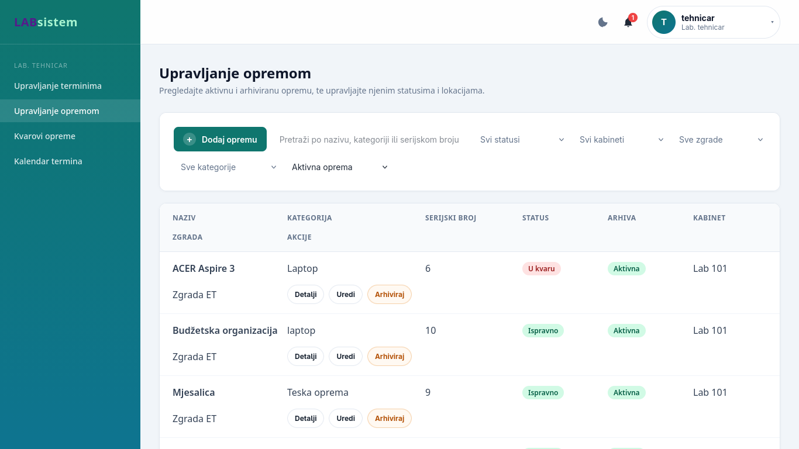

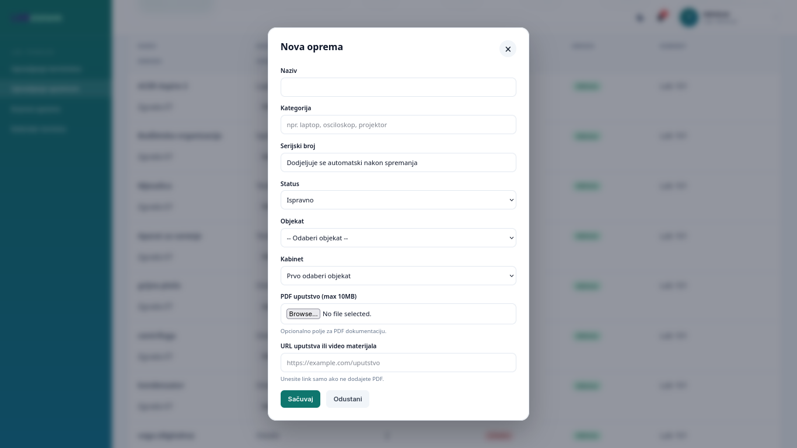

### 6.8 Kvarovi opreme (Tehničar, Admin)

Tehničar prati prijavljene kvarove i obrađuje ih.

Funkcije:

- pregled liste kvarova
- otvaranje detalja kvara
- statusi: Kvar, U obradi, Riješeno
- unos rješenja (obavezno za "Riješeno")
- slanje opće obavijesti korisnicima

Očekivani rezultat:

- status kvara se ažurira i korisnici dobijaju obavijest.

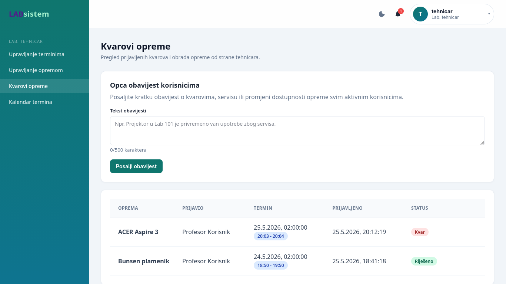

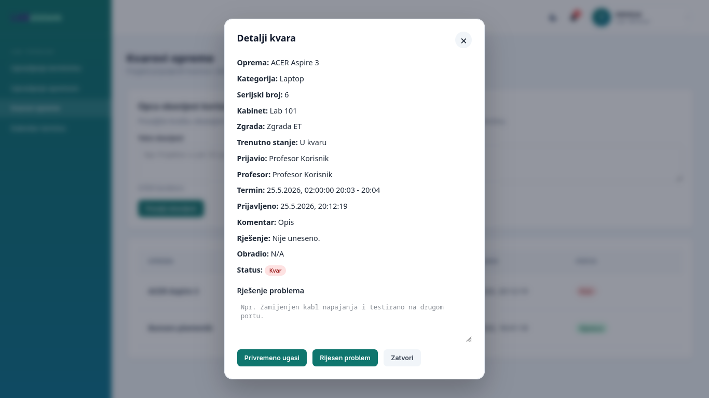

### 6.9 Historija termina (Profesor)

Prikaz završenih termina i mogućnost prijave kvara u roku od 24 sata.

Koraci za prijavu kvara:

1. Otvorite Historiju termina.
2. Kliknite termin.
3. Izaberite opremu i kliknite "Prijavi kvar".
4. Unesite komentar i pošaljite.

Očekivani rezultat:

- kvar je zabilježen, tehničar dobija obavijest.

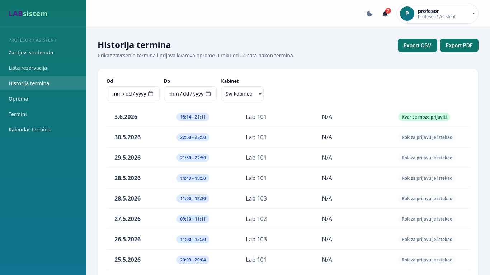

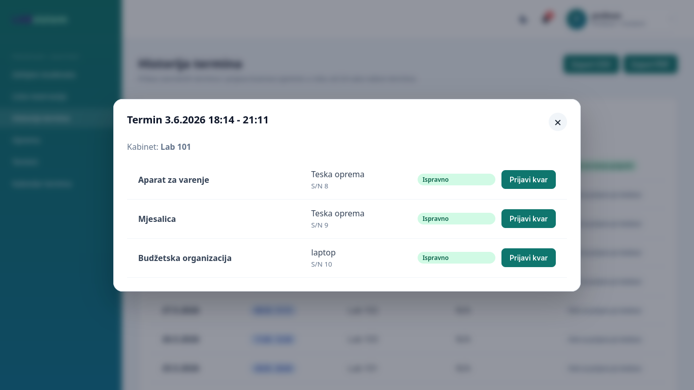

### 6.10 Upravljanje korisnicima (Administrator)

Administrator kreira, uređuje i aktivira/deaktivira korisnike.

Funkcije:

- filter po ulozi i statusu
- pretraga po imenu, emailu ili korisničkom imenu
- kreiranje korisnika
- promjena uloge
- deaktivacija/aktivacija

Očekivani rezultat:

- promjene se odmah prikazuju na listi.
- deaktivirani korisnik gubi pristup sistemu.

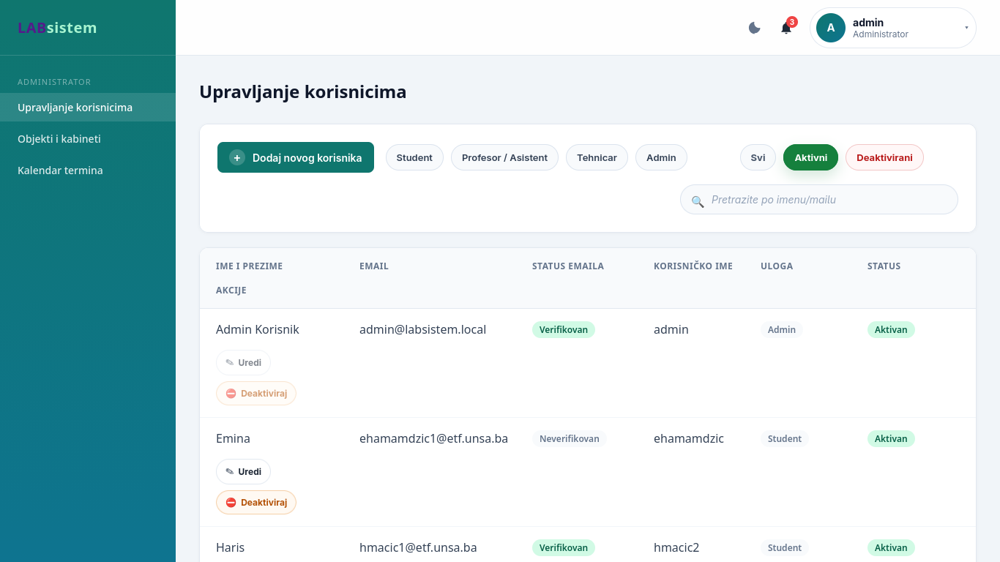

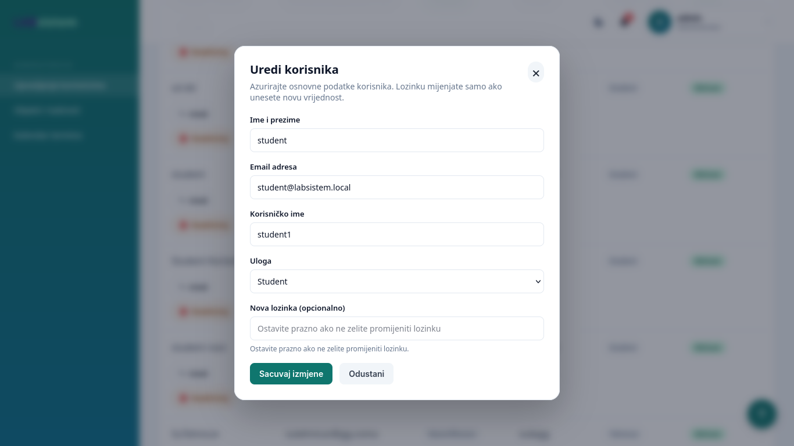

### 6.11 Objekti i kabineti (Administrator)

Administrator upravlja objektima i kabinetima.

Funkcije:

- dodavanje/uređivanje/brisanje objekta
- dodavanje/uređivanje/brisanje kabineta
- pregled detalja kabineta
- dodjela odgovornog profesora

Očekivani rezultat:

- objekti i kabineti se prikazuju u listi.

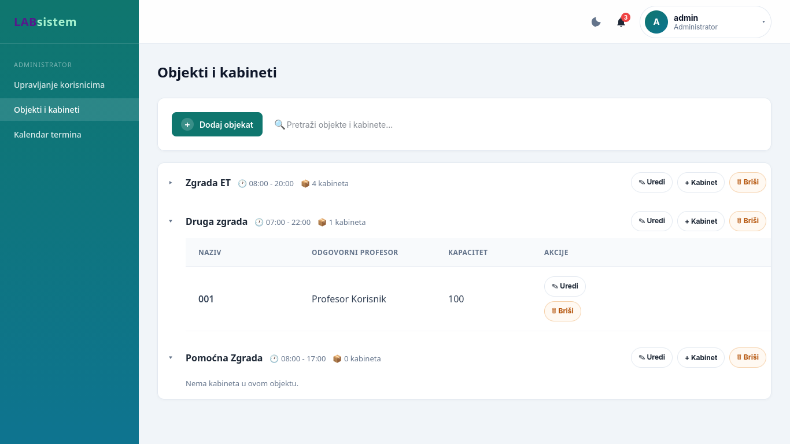

### 6.12 Moj profil (sve uloge)

Korisnik može ažurirati svoje podatke i promijeniti lozinku.

Funkcije:

- promjena imena, emaila, korisničkog imena
- pregled statusa email verifikacije
- slanje ponovne verifikacije
- promjena lozinke (modal)

Očekivani rezultat:

- podaci se ažuriraju, a statusi su odmah vidljivi.

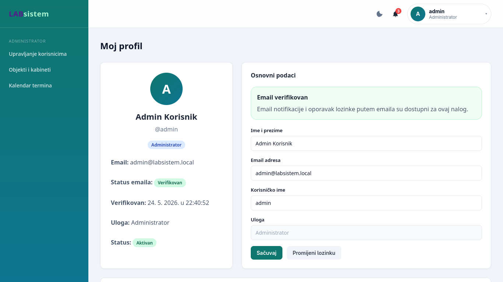

### 6.13 O aplikaciji (sve uloge)

Stranica sa opisom namjene i organizacije rada u sistemu.

## 7. Najvažniji korisnički tokovi (korak-po-korak)

### 7.1 Student: prijava na termin

1. Prijavite se.
2. Otvorite "Zakaži termin".
3. Odaberite termin i kliknite "Pošalji zahtjev".
4. Otvorite "Moje rezervacije" i pratite status zahtjeva.

Očekivani rezultat:

- zahtjev je na čekanju dok profesor ne donese odluku.
- nakon odobrenja termin prelazi u aktivne rezervacije.

### 7.2 Profesor: odobravanje zahtjeva

1. Otvorite "Zahtjevi".
2. Izaberite zahtjev.
3. Kliknite "Odobri" ili "Odbij".
4. Unesite komentar (opcionalno) i potvrdite.

Očekivani rezultat:

- status zahtjeva se mijenja, student dobija obavijest.

### 7.3 Profesor: rezervacija termina

1. Otvorite "Upravljanje terminima".
2. Pronađite slobodan termin.
3. Kliknite "Rezerviši".
4. Unesite limit osoba i označite vidljivost.

Očekivani rezultat:

- termin postaje rezervisan i po potrebi vidljiv studentima.

### 7.4 Tehničar: obrada kvara

1. Otvorite "Kvarovi opreme".
2. Kliknite na prijavljeni kvar.
3. Unesite rješenje (za "Riješeno").
4. Kliknite "Riješen problem" ili "Privremeno ugasi".

Očekivani rezultat:

- status kvara se ažurira, korisnici su obaviješteni.

### 7.5 Admin: dodavanje korisnika

1. Otvorite "Upravljanje korisnicima".
2. Kliknite "Dodaj novog korisnika".
3. Unesite podatke i odaberite ulogu.
4. Sačuvajte.

Očekivani rezultat:

- novi korisnik je kreiran i dobija privremenu lozinku.

## 8. Očekivani rezultati nakon većih akcija

- Prijava uspješna -> Dashboard prikazan.
- Neautorizovan pristup -> prikaz "Nemate pristup ovoj stranici".
- Promjena lozinke -> korisnik ostaje prijavljen i vidi potvrdu.
- Kreiranje termina -> termin vidljiv u listi i kalendaru.
- Odobren zahtjev -> termin prelazi u aktivne rezervacije studenta.
- Prijava kvara -> status opreme se prati u "Kvarovi opreme".

## 9. Ograničenja sistema i šta korisnik ne može raditi

- Student ne može kreirati termine niti upravljati opremom.
- Profesor ne može upravljati korisnicima i objektima.
- Tehničar ne može upravljati korisnicima i objektima.
- Administrator ne može slati zahtjeve za termine niti rezervisati termine umjesto profesora.
- Prijava kvara je moguća samo do 24 sata nakon završetka termina.
- Reset lozinke i email notifikacije su dostupni tek nakon verifikacije emaila.
- Deaktivirani korisnici ne mogu se prijaviti dok ih admin ne aktivira.

## 10. Dodatne napomene

- Sesija automatski ističe; u tom slučaju potrebno je ponovno prijavljivanje.
- Svaka akcija je ograničena ulogom korisnika.
- Statusi i poruke na ekranu uvijek potvrđuju da li je akcija uspješno izvršena.

